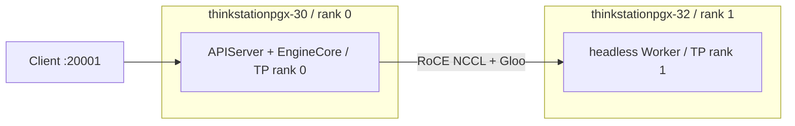
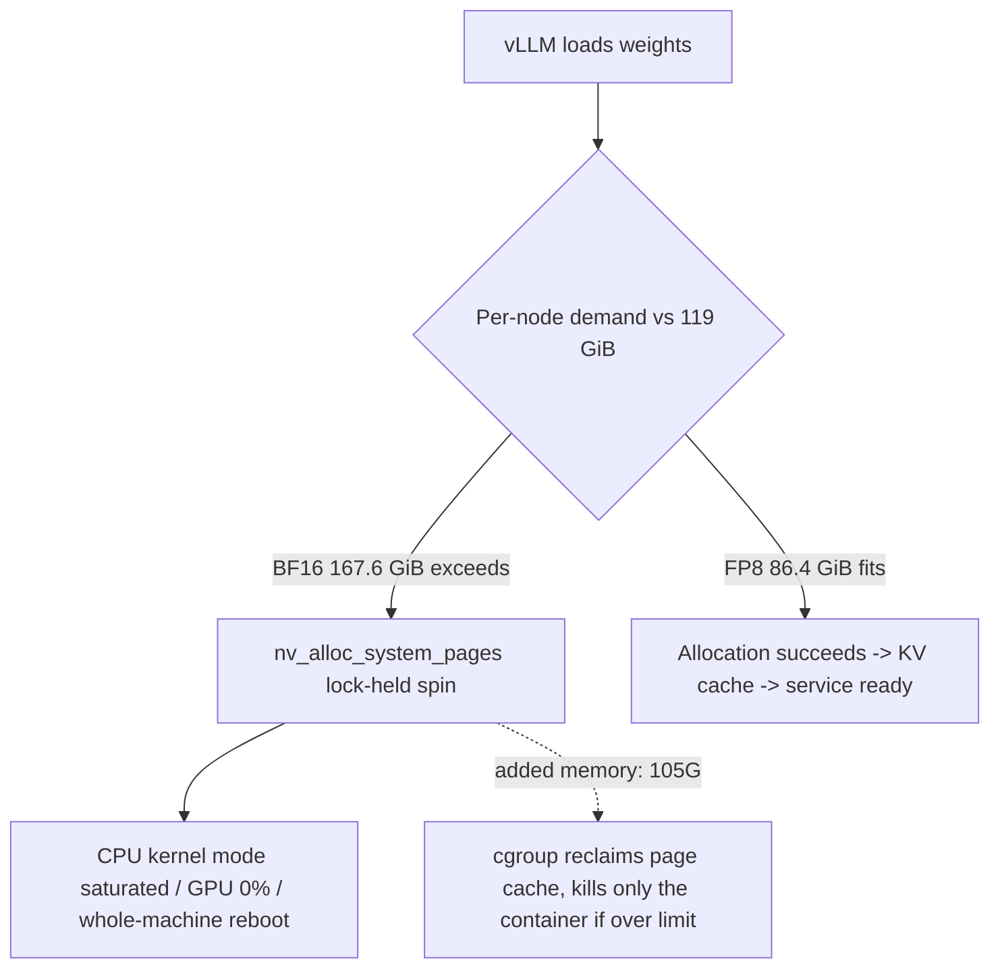

## Preface

Recently I got a few PGX units for research. This is an ARM-architecture personal GPU workstation from the NVIDIA–Lenovo collaboration. In actual use it always runs into all kinds of problems. The main content of this article is repairing a recently obtained PGX whose operating system could not boot, reinstalling the OS, and then using the QSFP ports that came with the purchased machines for multi-GPU interconnection.

## Main Text

### Reinstalling the OS

This is mentioned in the [Lenovo official documentation](https://support.lenovo.com/tw/zh/solutions/ht518087-how-to-install-dgx-spark-os-pgx-workstation), but the most important thing is that it does not provide the ISO image for reinstallation. Many people may download the image directly from the NVIDIA official website. I looked into this: the GB10 machine image provided by NVIDIA is not the same as the Lenovo-customized image. Here I provide a [download link](https://download.lenovo.com/km/media/attachment/DGXOS_7_4_0_GA2_0_PGX.iso) for the PGX image, but if your local network has issues that prevent access to the download link above, you can also try downloading via the [magnet link](magnet:?xt=urn:btih:3eec242622ead59b31977c59824c83fc73bd9a12&dn=DGXOS_7_4_0_GA2_0_PGX.iso&tr=udp%3A%2F%2Ftracker.opentrackr.org%3A1337%2Fannounce) I uploaded to my own server (please weigh the security of the image file yourself; I cannot make any guarantees, and any subsequent security issues are not my responsibility)

Reinstalling the OS itself is not difficult, and the Lenovo official link given above is also quite detailed. Here, to prevent some people from being unable to access it due to network issues, I will briefly go over it. Assume you have already downloaded the PGX ISO image file, then download the rufus tool from rufus's [GitHub official repository](https://github.com/pbatard/rufus), then insert a USB drive (capacity of at least 16G), open the rufus tool, select the USB drive, then select the downloaded ISO image, leave everything else unchanged at the defaults, then click Start directly


After some time, the USB drive becomes a boot drive, then just click Close

Neither the PGX's external Type-C ports nor the included USB adapter ports work with 2.4G wireless keyboards; you have to use an old-fashioned USB-wired keyboard. After powering on, keep pressing the Delete key to enter the boot page, press Tab on the keyboard, select the bss option, enter the hardware boot order, and select USB drive boot


After entering the GRUB menu, select the DGX install option


Then click to install the DGX system


Then the operating system will install automatically; you just need to wait. After installation completes, you will enter the familiar initialization interface to configure language, timezone, account password, and so on

### Multi-machine interconnection

Although it is titled multi-machine interconnection, in fact I only have two machines here, because the ports on the back of GB10-series machines use QSFP (200G) interfaces, and switches for this interface are hard for individuals to buy or are very expensive, so I only demonstrate two machines here. However, from the configuration principle, connecting more than two should be supported

The entire tutorial can also be found on the [NVIDIA official website](https://developer.nvidia.cn/build-spark/connect-two-sparks#i7njvai), but as above, because some people may have network issues, I will also recap it here

The first step is to confirm whether the usernames on the two machines are the same; just use the `whoami` command. If the usernames on the two machines are different, then you need to create two users with the same username in the system. Basic Linux commands will not be shown here; you can search for them yourselves

The second step is also very simple: use the QSFP ports to connect the two machines. Be careful not to use force when connecting; the ports are keyed, and you cannot insert them the wrong way. After connecting, run the `ibdev2netdev` command, and you will see the following result

```sh
lenovo@thinkstationpgx-3262:~/PGX$ ibdev2netdev
rocep1s0f0 port 1 ==> enp1s0f0np0 (Up)
rocep1s0f1 port 1 ==> enp1s0f1np1 (Down)
roceP2p1s0f0 port 1 ==> enP2p1s0f0np0 (Up)
roceP2p1s0f1 port 1 ==> enP2p1s0f1np1 (Down)
```

The third step is configuring the machines' `netplan`. The official documentation provides three configuration methods (one automatic and two manual); here I used automatic configuration

First write a yaml configuration file under the `netplan` directory

```sh
sudo tee /etc/netplan/40-cx7.yaml > /dev/null <<EOF
network:
  version: 2
  ethernets:
    enp1s0f0np0:
      link-local: [ ipv4 ]
    enp1s0f1np1:
      link-local: [ ipv4 ]
EOF
```

Then configure the corresponding permissions and deploy

```sh
# Configure permissions
sudo chmod 600 /etc/netplan/40-cx7.yaml

# Apply configuration
sudo netplan apply
```

After this step is complete, using the `ifconfig` command or the `ip addr` command you will see that the corresponding NICs from step two have been automatically assigned IP addresses; note that this step needs to be done on both machines

The fourth step is configuring passwordless SSH certificates. NVIDIA official provides a [script](https://github.com/NVIDIA/dgx-spark-playbooks/blob/main/nvidia/connect-two-sparks/assets/discover-sparks), with the following content:

```sh
#
# SPDX-FileCopyrightText: Copyright (c) 1993-2025 NVIDIA CORPORATION & AFFILIATES. All rights reserved.
# SPDX-License-Identifier: Apache-2.0
#
# Licensed under the Apache License, Version 2.0 (the "License");
# you may not use this file except in compliance with the License.
# You may obtain a copy of the License at
#
# http://www.apache.org/licenses/LICENSE-2.0
#
# Unless required by applicable law or agreed to in writing, software
# distributed under the License is distributed on an "AS IS" BASIS,
# WITHOUT WARRANTIES OR CONDITIONS OF ANY KIND, either express or implied.
# See the License for the specific language governing permissions and
# limitations under the License.
#
#!/bin/env bash

# discover-sparks
# Discover available systems using avahi-browse and generate MPI hosts file
# Searches all active interfaces automatically
#
# Usage: bash ./discover-sparks

set -euo pipefail

# Check if running as root or with sudo
if [[ $EUID -eq 0 ]] || [[ -n "${SUDO_USER:-}" ]]; then
    echo "Error: This script should not be run as root or with sudo"
    echo "Please run as a regular user"
    exit 1
fi

# Dynamically get interface names from ibdev2netdev output
# Use ibdev2netdev to list Infiniband devices and their network interfaces.
# The awk command searches for lines containing 'Up)' (i.e., interfaces that are up)
# and prints the 5th field, which is the interface name (e.g., enp1s0f0np0).
# The tr command removes any parentheses from the output.
INTERFACES=($(ibdev2netdev | awk '/Up\)/ {print $5}' | tr -d '()'))
if [ ${#INTERFACES[@]} -eq 0 ]; then
    echo "ERROR: No active interfaces found via ibdev2netdev."
    exit 1
fi

# Create temporary file for processing
TEMP_FILE=$(mktemp)
trap 'rm -f "$TEMP_FILE"' EXIT

# Check if avahi-browse is available
if ! command -v avahi-browse &> /dev/null; then
    echo "Error: avahi-browse not found. Please install avahi-utils package."
    exit 1
fi

# Run avahi-browse and filter for SSH services on specified interfaces
# -p: parseable output
# -r: resolve host names and addresses
# -f: terminate after dumping all entries available at startup
avahi_output=$(avahi-browse -p -r -f -t _ssh._tcp 2>/dev/null)

# Filter for both interfaces
found_services=false
for interface in "${INTERFACES[@]}"; do
    if echo "$avahi_output" | grep "$interface" >> "$TEMP_FILE"; then
        found_services=true
    fi
done

if [ "$found_services" = false ]; then
    echo "Warning: No services found on any specified interface"
    exit 0
fi

# Extract IPv4 addresses from the avahi-browse output
# Format: =;interface;IPv4;hostname\032service;description;local;fqdn;ip_address;port;
grep "^=" "$TEMP_FILE" | grep "IPv4" | while IFS=';' read -r prefix interface protocol hostname_service description local fqdn ip_address port rest; do
    # Clean up any trailing data
    clean_ip=$(echo "$ip_address" | sed 's/;.*$//')

    # Validate IP address format
    if [[ $clean_ip =~ ^[0-9]{1,3}\.[0-9]{1,3}\.[0-9]{1,3}\.[0-9]{1,3}$ ]]; then
        echo "$clean_ip" >> "$TEMP_FILE.sorted"
        echo "Found: $clean_ip ($fqdn)"
    else
        echo "Warning: Invalid IP format: $clean_ip"
    fi
done

# Sort and remove duplicates
if [[ -s "$TEMP_FILE.sorted" ]]; then
    sort -u "$TEMP_FILE.sorted" -o "$TEMP_FILE.sorted"
else
    echo "No IPv4 addresses found."
    exit 1
fi

# Generate a shared SSH key if it doesn't exist
SHARED_KEY="$HOME/.ssh/id_ed25519_shared"
if [[ ! -f "$SHARED_KEY" ]]; then
    echo "Generating shared SSH key for all nodes..."
    ssh-keygen -t ed25519 -N "" -f "$SHARED_KEY" -q -C "shared-cluster-key"
fi

echo ""
echo "Setting up shared SSH access across all nodes..."
echo "You may be prompted for your password on each node."

# Ensure local .ssh directory exists with correct permissions
mkdir -p "$HOME/.ssh"
chmod 700 "$HOME/.ssh"

# Add shared public key to local authorized_keys
if ! grep -qF "$(cat "$SHARED_KEY.pub")" "$HOME/.ssh/authorized_keys" 2>/dev/null; then
    cat "$SHARED_KEY.pub" >> "$HOME/.ssh/authorized_keys"
    chmod 600 "$HOME/.ssh/authorized_keys"
    echo "  ✓ Added shared public key to local authorized_keys"
fi

# Distribute shared key to all remote nodes
while read -r node_ip; do
    if [[ -n "$node_ip" ]]; then
        echo "Configuring $node_ip..."

        # Copy shared key to remote node and set up authorized_keys
        if scp -o StrictHostKeyChecking=accept-new "$SHARED_KEY" "$SHARED_KEY.pub" "$USER@$node_ip:~/.ssh/" &>/dev/null; then
            ssh -n -o StrictHostKeyChecking=accept-new "$USER@$node_ip" "
                chmod 700 ~/.ssh
                chmod 600 ~/.ssh/id_ed25519_shared
                chmod 644 ~/.ssh/id_ed25519_shared.pub

                # Add shared public key to authorized_keys if not present
                if ! grep -qF \"\$(cat ~/.ssh/id_ed25519_shared.pub)\" ~/.ssh/authorized_keys 2>/dev/null; then
                    cat ~/.ssh/id_ed25519_shared.pub >> ~/.ssh/authorized_keys
                    chmod 600 ~/.ssh/authorized_keys
                fi

                # Create/update SSH config to use shared key by default
                if ! grep -q 'IdentityFile.*id_ed25519_shared' ~/.ssh/config 2>/dev/null; then
                    echo 'Host *' >> ~/.ssh/config
                    echo '    IdentityFile ~/.ssh/id_ed25519_shared' >> ~/.ssh/config
                    chmod 600 ~/.ssh/config
                fi
            " &>/dev/null

            echo "  ✓ Successfully configured $node_ip with shared key"
        else
            echo "  ✗ Failed to configure $node_ip"
        fi
    fi
done < "$TEMP_FILE.sorted"

# Update local SSH config to use shared key
if ! grep -q 'IdentityFile.*id_ed25519_shared' "$HOME/.ssh/config" 2>/dev/null; then
    touch "$HOME/.ssh/config"
    echo 'Host *' >> "$HOME/.ssh/config"
    echo '    IdentityFile ~/.ssh/id_ed25519_shared' >> "$HOME/.ssh/config"
    chmod 600 "$HOME/.ssh/config"
    echo "  ✓ Updated local SSH config to use shared key"
fi

echo ""
echo "Shared SSH setup complete!"
echo "All nodes can now SSH to each other using the shared key (id_ed25519_shared)."
```

Here if you encounter this problem

```sh
Error: This script should not be run as root or with sudo
Please run as a regular user
```

You need to start a new terminal, then without doing anything else, run this script directly

After this script executes successfully, you can use the following command to test the result; the IP address is the output from step three

```sh
# The return result is the hostname of the machine at the corresponding IP address
ssh <ip address> hostname
```

At this point, the steps for connecting two PGX units via QSFP are complete; next is the software-level work

### Building a multi-GPU cluster

This involves some specialized terms (Ray cluster, NCCL communication), but the purpose of this article is not terminology explanation, but how to use these things directly (even so, some simple principle introduction is still needed); the large-model environment in this article is docker+vllm

Here we use the latest `Qwen/Qwen3.8-Flash-Next-FP8`, mainly because BF16 is **not viable** on these two machines—not an ordinary OOM, but dragging the local machine to death and reboot; what finally went into production is FP8, with a topology of TP=2 across two single-GPU nodes, the API on the local machine at `http://localhost:20001`, and the external model name `qwen3.8-flash-next`

#### Why two machines are required

GB10 is a unified memory architecture. The "GPU memory" reported by `nvidia-smi` and the physical memory in `/proc/meminfo` are the same pool; each machine physically has only **119 GiB**. The so-called "requesting GPU memory" takes the kernel path through `nv_alloc_system_pages`, that is, asking the system for pages.

The two checkpoints of Qwen3.8-Flash-Next:

| Checkpoint | Weight size (as read by the loader) | Disk occupancy | TP=2 per-node weights |
| --- | --- | --- | --- |
| `Qwen/Qwen3.8-Flash-Next` (BF16) | 335.28 GiB | 336G | 167.6 GiB |
| `Qwen/Qwen3.8-Flash-Next-FP8` | 172.78 GiB | 173G | 86.4 GiB |

BF16 is 167.6 GiB per node, **48.6 GiB** more than 119 GiB. The gap cannot be made up by paging; the driver will hold a lock in the kernel and repeatedly reclaim and retry, and the whole machine dies along with it. This path has already been walked in actual testing (mentioned later).

FP8 weights per node actually occupy **86.33 GiB**. KV and GDN state still need to be added. In `config.json`, `num_hidden_layers=48`, `full_attention_interval=4`, that is, 12 QSA full-attention layers and 36 Gated DeltaNet layers; `num_key_value_heads=2`, `head_dim=256`. KV counted as BF16:

```
12 layers × 2 KV heads × 256 dim × 2 (K/V) × 2 bytes = 24 KiB / token
After TP=2, 12 KiB / token per node
262144 context, a single full-length sequence ≈ 3 GiB / node
```

GDN recurrent state: 36 layers × 48 V heads × 128 × 128 × 2 bytes = 54 MiB / sequence, 27 MiB after TP=2; `--max-num-seqs 8` totals 216 MiB, which can be ignored. Weights 86.4 GiB plus KV and a bit of host overhead come to about 95 GiB, which fits in 119 GiB, so `--max-model-len 262144` can be kept.

In the final CUDA graph round, the local KV cache was **7.62 GiB / 541,401 tokens**, maximum concurrency for 262144 context **2.07x**; the peer KV was **6.78 GiB**. The two sides differ slightly because the idle memory on the two machines was not exactly the same at the time, and vLLM each took a cut according to `--gpu-memory-utilization 0.80` (budget 95.7 GiB)

#### There is only one topology choice

This architecture has N-gram embedding (`ngram_vocab_size_base=20000000`, attached at layer 2). vLLM **does not support pipeline parallelism** for it. PLE offloading the n-gram table to CPU might be tryable on a single machine, but **distributed mode is not supported**. Both machines are single-GPU, so only one topology remains: split into two shares with tensor parallelism, one GPU per machine.



The local machine is the master: `169.254.94.252`, `NODE_RANK=0`, running the full APIServer and EngineCore, with HTTP bound to `0.0.0.0:20001`. The peer is the follower: `169.254.159.206`, `NODE_RANK=1`, running only a `--headless` Worker, not serving HTTP externally. NCCL goes over the two RoCE logical NICs on QSFP, and the Gloo / TCP control plane goes over `enp1s0f0np0`. The default route remains on `enP7s7` (the `192.168.40.x` LAN segment); **do not change the default gateway to QSFP**.

The two machines use the same compose, distinguishing identity via `NODE_RANK` and `VLLM_HOST_IP` in each machine's `.env`

#### Three checks before starting work

**1\. Kernel-mode and user-mode driver versions must match.** The peer once had kernel `580.159.03` and user-mode `580.173.02`; the machine had already been running continuously for fifty-plus days, and GPU initialization failed inside Docker. It only recovered after rebooting the peer. Both the local machine and the peer must be able to see the GPU inside the container; do not just glance at `nvidia-smi` on the host.

**2\. Firewall must allow the QSFP network segments and the API port.** The local UFW defaults to DROP, which will block `29501/tcp` used by torch distributed. You need:

```
sudo ufw allow from 169.254.0.0/16
sudo ufw allow from 192.168.101.0/24
sudo ufw allow 20001/tcp
```

UFW was not enabled on the peer at the time, so no change was needed. The rules must survive reboot.

**3\. Both RoCE logical NICs must be up.** The physical port is QSFP port 0, split into two logical NICs:

| Ethernet name | RoCE name | Local | Peer |
| --- | --- | --- | --- |
| `enp1s0f0np0` | `rocep1s0f0` | `169.254.94.252/16` | `169.254.159.206/16` |
| `enP2p1s0f0np0` | `roceP2p1s0f0` | `192.168.101.10/24` | `192.168.101.11/24` |

GID index **3** is RoCEv2 + IPv4. `ib_write_bw` reached **109 Gb/s** on each of the two. NCCL uses `NCCL_IB_HCA==rocep1s0f0,roceP2p1s0f0` (the equals sign is NCCL's exact-match syntax) plus `NCCL_IB_MERGE_NICS=1`, merging the two into a single 200 GbE-class transport

#### Image and weights

Qwen3.8-Flash-Next must use the dedicated image `vllm/vllm-openai:qwen38-flash-next` (arm64). The generic `v0.28.0` **does not recognize** this architecture; pulling the wrong image will exit directly at the model initialization stage. The version string that actually ran in this round is `v0.1.dev20073+g8e685d198`.

One of the GB10s here has very slow network, so both the image and the weights were prepared on the local machine and then pushed over via QSFP. The working directory on both sides is `/home/lenovo/vllm`, and the Hugging Face cache is mounted at `/home/lenovo/vllm/huggingface`

For downloading you can run `hf download` with a generic image already on the local machine, just bind the cache directory to the path above; there is no need to download inside the dedicated image. The HF cache owner is root, and `trees/*.json` is often mode `600`, which the local user cannot read, and rsync will fail on these small files. Before transferring, first:

```
sudo chmod -R a+rX /home/lenovo/vllm/huggingface/hub/models--Qwen--Qwen3.8-Flash-Next-FP8
```

Three notes:

*   Do not go via hostname or `192.168.40.x`; traffic must go via `169.254.159.206`.
*   Do not use `rsync -L`. HF's `snapshots/` are symlinks pointing to `blobs/`; dereferencing will double the volume.
*   Do not enable compression for rsync / SSH. On 200 GbE, compression will only saturate the CPU and leave the bandwidth unused.

After `docker load`, the peer's image ID may differ from the local machine's; this is because load rewrote the local image metadata. As long as the RootFS layers match, it can be used

#### Key design of the compose

The complete file is in the appendix. Here I only cover "why it must be written this way"; each item corresponds to a failure that already happened.

**Host network, InfiniBand devices, and locked-page permissions.** `network_mode: host` is because NCCL needs to get the host NICs directly; a mapping like `8000:20001` inside the container would make the NCCL handshake go through the wrong namespace. vLLM itself uses `--host 0.0.0.0 --port 20001`, consistent with the external port of other compose files on the local machine (for example `qwen3.6-35b-compose.yml`). Without `/dev/infiniband`, `IPC_LOCK`, and `memlock: -1`, RoCE falls back to sockets and bandwidth drops to unusable.

**Force Gloo to IPv4, and turn off libuv.** The first distributed handshake hung on c10d's IPv6 socket timeout. The environment variables are:

```
NCCL_SOCKET_FAMILY: AF_INET
GLOO_SOCKET_FAMILY: AF_INET
GLOO_SOCKET_IFNAME: enp1s0f0np0
GLOO_USE_LIBUV: "0"
TORCH_GLOO_USE_LIBUV: "0"
```

The control plane goes over `enp1s0f0np0`, the data plane over the two RoCE NICs. `NCCL_IB_GID_INDEX=3` corresponds to RoCEv2+IPv4; `NCCL_CUMEM_ENABLE=0` is the safe choice on this platform.

**Container memory hard limit 105G, explicit** `restart: "no"`**.** Both machines are cgroup v2 + systemd driver; driver allocations are counted into the container memcg. When over limit it first reclaims page cache, then OOM-kills the **container**, rather than dragging the whole machine to death. `restart: "no"` avoids automatically bringing it back up after a crash and repeatedly slamming memory. `--gpu-memory-utilization 0.80` gives about 95.7 GiB of GPU budget, leaving about 9 GiB between that and the 105G cap for the Python / torch host. `--distributed-timeout-seconds 3600` is because loading 86 GiB on two nodes has a time skew (peer about 300 seconds, local about 850 seconds), and the default 600-second NCCL timeout is tight.

**Wrap the entrypoint in a layer of bash; rank 1 must add** `--headless`**.** The image's default `ENTRYPOINT` is `["vllm","serve"]`. Compose needs to interpolate `NODE_RANK` / `MODEL_ID` from each machine's `.env`, so it is changed to `/bin/bash -lc`. If rank 1 runs a full EngineCore, it will blow up in `_initialize_kv_caches`:

```
AssertionError: collective_rpc should not be called on follower node
```

The follower only acts as a Worker. HTTP is only on rank 0.

**Compilation flags.** First get it running with `--enforce-eager` (the dual-Spark configuration measured on the NVIDIA forum), then after it is stable switch to `-cc.mode=0 -cc.cudagraph_mode=FULL_DECODE_ONLY`: skip inductor compilation that hangs on GB10, keep only decode CUDA graph. Production is already the latter. Note that the field name must be **underscore** `cudagraph_mode`; writing it with a hyphen will be rejected by pydantic

#### Startup and watchdog

Before starting, drop page cache on both machines. When BF16 failed previously, `buff/cache` had already reached 110 GiB; the page cache from reading safetensors and the driver were fighting over the same unified memory:

```
sync && echo 3 | sudo tee /proc/sys/vm/drop_caches
```

Start rank 0 first, then rank 1:

```
# Local
cd /home/lenovo/vllm
sudo docker compose -f qwen3.8-flash-next-compose.yml --env-file .env up -d --force-recreate --no-deps

# Peer, via QSFP
ssh -T -o Compression=no -o BatchMode=yes -c aes128-gcm@openssh.com \
  lenovo@169.254.159.206 \
  'cd /home/lenovo/vllm && sudo docker compose -f qwen3.8-flash-next-compose.yml --env-file .env up -d --force-recreate --no-deps'
```

**Do not use** `nvidia-smi` **for liveness probes.** Once the driver is stuck in `nv_alloc_system_pages` holding the RM global write lock, `nvidia-smi` itself will also be blocked by that same lock—in the BF16 incident it blocked for more than 614 seconds. The correct liveness probe is polling `MemAvailable` in `/proc/meminfo`: if it drops below **5 GiB**, immediately `docker stop`, seizing disposal rights before the kernel. The watchdog script is in the appendix.

Expected log order:

1.  rank 1: `Launching vLLM ... headless multiproc executor`
2.  Both sides: `rank N in world size 2 is assigned as ... TP rank N`
3.  `Loading model from scratch...`
4.  `Model loading took 86.33 GiB memory ...`
5.  `GPU KV cache size: ... tokens`
6.  rank 0: `Graph capturing finished in 5 secs, took 0.36 GiB` (this line is absent in eager mode)
7.  rank 0: `Application startup complete.`

Timeline of this CUDA graph round:

| Step | Peer | Local |
| --- | --- | --- |
| Load weights | 300.79 s (model ready 307.62 s) | 850.66 s (model ready 857.87 s) |
| init engine (profile / KV / warmup) | Aligned with local, stuck on collective communication | 73.57 s |
| CUDA graph capture | Counted in the previous row | 5 s / 0.36 GiB |
| MemAvailable after startup | about 15 GiB | about 12 GiB |

During loading, MemAvailable dropping from 110+ GiB to 17–24 GiB is normal; the weights have entered unified memory. The watchdog threshold of 5 GiB still leaves headroom. Local loading is clearly slower than the peer; the root cause is that the local root partition was fuller at the time, and sequentially reading 173G of safetensors eats page cache more; `--distributed-timeout-seconds 3600` was prepared for this skew

#### Verification

Only hit rank 0. First check whether the model is registered:

```
curl -sS http://localhost:20001/v1/models
```

It returns `id` as `qwen3.8-flash-next`, `root` as `Qwen/Qwen3.8-Flash-Next-FP8`, `max_model_len` as 262144.

Token generation and thinking. Qwen3.8 defaults to `enable_thinking=True`, and vLLM has `--reasoning-parser qwen3` enabled. Actual test of "factorial of 3": `completion_tokens=207`, of which `reasoning_tokens=189`, and the body gives "3×2×1=6". This version of the API puts the thinking process in `message.reasoning` / `usage.completion_tokens_details.reasoning_tokens`; the old field `reasoning_content` may not still be present.

Tool calling. `--enable-auto-tool-choice --tool-call-parser qwen3_xml`, given a `get_weather` function schema, asked "How is the weather now? Please call the tool to query":

*   `finish_reason`: `tool_calls`
*   `tool_calls[0].function.name`: `get_weather`
*   `arguments`: `{"city": "Beijing"}`

Only when all three of these pass can the service be considered usable, rather than "the process is still there and the port can be connected"

#### Postmortem of pitfalls

This is the part the whole article really needs to leave behind; all three pitfalls exploded on the production path

##### BF16: not OOM, but whole-machine deadlock

Following the order of "try BF16 first, then FP8 if GPU memory is insufficient", after BF16 loaded to `Loading model from scratch...`, not a single compute kernel ever started, GPU utilization 0%, yet the CPU was saturated by kernel mode. The call stack from the kernel log (boot -1):

```
VLLM::Worker_TP:507121 <writer>  holds RM global rw-semaphore
  nvidia_unlocked_ioctl -> RmIoctl -> Nv04AllocWithAccessSecInfo
  -> rmapiAllocWithSecInfo -> memdescAlloc -> osAllocPagesInternal
  -> nv_alloc_pages -> nv_alloc_system_pages   <-- stuck here
INFO: task nvidia-smi:508972 blocked for more than 614 seconds
```

Under unified memory, allocating 167.6 GiB of weights is asking the kernel for 167.6 GiB of system pages, while physically there are only 119 GiB. The driver cannot get the pages, so it repeatedly reclaims and retries while holding the RM write lock. The OOM killer never managed to intervene—it kills user-mode processes, and cannot kill a kernel path stuck in the driver allocation loop. At the time `buff/cache` was already 110 GiB; the page cache built up by reading weights and the driver fought over the same memory, aggravating the deadlock. In the end the local machine could only be rebooted.



The point of the guardrail is here: the 105G memcg cap turns over-limit into "kill only the container". It cannot save BF16—167 GiB will never fit into 119 GiB—but it can stop the next configuration mistake from dragging the whole machine to death. `restart: "no"` guarantees that after being killed it will not automatically charge in again

##### rank 1 omitted `--headless`

In the first FP8 round both sides ran a full EngineCore. The weights had actually already been loaded in: peer 340.86 s, local 831.18 s, MemAvailable dropped to 17–23 GiB, looking quite healthy. Then on the peer in `_initialize_kv_caches`:

```
AssertionError: collective_rpc should not be called on follower node
```

Once the peer died, the local NCCL followed with `IBV_WC_RETRY_EXC_ERR`. In the image source, `--headless` is commented as “headless workers (for multi-node PP/TP)”. After compose used bash to add this argument to rank 1 according to `NODE_RANK`, KV initialization passed on the first try

##### The CUDA graph field name uses underscores

The plan wrote `--cudagraph-mode FULL_DECODE_ONLY`. This version of the CLI does not have this top-level argument; the nested form `-cc.cudagraph-mode=FULL_DECODE_ONLY` is passed as-is by FlexibleArgumentParser to pydantic, which reports:

```
argument --compilation-config/-cc: 1 validation error for CompilationConfig
cudagraph-mode
  Unexpected keyword argument
```

The container immediately exit 2. The correct form:

```
-cc.mode=0
-cc.cudagraph_mode=FULL_DECODE_ONLY
```

Equivalent JSON also works: `-cc '{"mode":0,"cudagraph_mode":"FULL_DECODE_ONLY"}'`. What the logs confirm as taking effect is `cudagraph_mode: <CUDAGraphMode.FULL_DECODE_ONLY: (2, 0)>`, capture sizes `[1, 2, 4, 8, 16]` (constrained by `--max-num-seqs 8`)

#### Performance and trade-offs

The same request to "count from 1 to 80", `temperature=0`, `enable_thinking=False`, `completion_tokens=231`:

| Configuration | Time | tok/s | CUDA graph occupancy |
| --- | --- | --- | --- |
| `--enforce-eager` | 10.211 s | 22.62 | 0 |
| `-cc.mode=0` + `FULL_DECODE_ONLY` | 9.905 s | 23.32 | local 0.36 GiB |

The community has reported order-of-magnitude decode speedups on this architecture; we did not see that. The reason is very specific: decode is already fast, and the cross-machine TP RoCE allreduce is the main path; CUDA graph can only eat the local kernel-launch overhead, not that trip over the network. The graph only occupies an extra 0.36 GiB, and KV went from eager's 503,285 tokens / 1.92x to 541,401 tokens / 2.07x, without blowing the budget, so production keeps it.

Do not enable the graph before you have stood firm. Eager is the baseline for verifying correctness; the graph is a bonus after correctness

## Closing

This article spans a long stretch; from repairing the PGX to building the dual-GPU large model, about two months passed in between, but fortunately in the end all the pitfalls were stepped in, and the tool also went live (in the middle the whole machine locked up and I once thought I would have to repeat the "reinstall the OS" step); the configuration itself is not hard, what matters most is the process of troubleshooting. The IP addresses and so on mentioned earlier need to be changed to the corresponding content on your own machines; there is quite a bit of content in the article, and omissions are hard to avoid, so please correct me, readers

## Appendix A: the two `.env` files

Local `/home/lenovo/vllm/.env` (rank 0):

```
MODEL_ID=Qwen/Qwen3.8-Flash-Next-FP8
NODE_RANK=0
VLLM_HOST_IP=169.254.94.252
```

The same-named file on the peer:

```
MODEL_ID=Qwen/Qwen3.8-Flash-Next-FP8
NODE_RANK=1
VLLM_HOST_IP=169.254.159.206
```

`MASTER_ADDR` is written in the compose, fixed to the local `169.254.94.252`, and should not change along with `VLLM_HOST_IP`

## Appendix B: the complete compose

File path: `/home/lenovo/vllm/qwen3.8-flash-next-compose.yml`. The content on both machines must be identical; after changing it, push to the peer via QSFP with scp.

```
# Dual-node TP=2 for Qwen3.8-Flash-Next across two GB10 workstations.
# Same file on both machines; NODE_RANK / VLLM_HOST_IP / MODEL_ID come from .env.
# host network: vLLM binds :20001 directly (same external port as qwen3.6-35b-compose.yml).
services:
  vllm:
    image: vllm/vllm-openai:qwen38-flash-next
    container_name: vllm-qwen38
    network_mode: host
    ipc: host
    restart: "no"
    stdin_open: true
    tty: true
    volumes:
      - /home/lenovo/vllm/huggingface:/root/.cache/huggingface
      - /etc/localtime:/etc/localtime:ro
    devices:
      - /dev/infiniband:/dev/infiniband
    cap_add:
      - IPC_LOCK
      - SYS_PTRACE
    security_opt:
      - seccomp:unconfined
    ulimits:
      memlock: -1
      stack: 67108864
    deploy:
      resources:
        limits:
          memory: 105G
        reservations:
          devices:
            - driver: nvidia
              count: all
              capabilities: [gpu]
    environment:
      PYTHONUNBUFFERED: "1"
      MODEL_ID: ${MODEL_ID}
      NODE_RANK: ${NODE_RANK}
      VLLM_HOST_IP: ${VLLM_HOST_IP}
      MASTER_ADDR: "169.254.94.252"
      NCCL_IB_HCA: "=rocep1s0f0,roceP2p1s0f0"
      NCCL_IB_DISABLE: "0"
      NCCL_IB_GID_INDEX: "3"
      NCCL_IB_MERGE_NICS: "1"
      NCCL_SOCKET_IFNAME: enp1s0f0np0
      NCCL_SOCKET_FAMILY: AF_INET
      GLOO_SOCKET_IFNAME: enp1s0f0np0
      GLOO_SOCKET_FAMILY: AF_INET
      GLOO_USE_LIBUV: "0"
      TORCH_GLOO_USE_LIBUV: "0"
      TP_SOCKET_IFNAME: enp1s0f0np0
      NCCL_NET_PLUGIN: none
      NCCL_IB_ROCE_VERSION_NUM: "2"
      NCCL_CUMEM_ENABLE: "0"
      NCCL_DEBUG: WARN
    # Rank 1 must be --headless (worker only). Running a full EngineCore on the
    # follower hits: AssertionError: collective_rpc should not be called on follower node
    entrypoint: ["/bin/bash", "-lc"]
    command:
      - |
        set -euo pipefail
        if [ "${NODE_RANK}" = "1" ]; then
          exec vllm serve "${MODEL_ID}" \
            --served-model-name qwen3.8-flash-next \
            --tensor-parallel-size 2 \
            --nnodes 2 \
            --node-rank "${NODE_RANK}" \
            --master-addr 169.254.94.252 \
            --master-port 29501 \
            --distributed-executor-backend mp \
            -cc.mode=0 \
            -cc.cudagraph_mode=FULL_DECODE_ONLY \
            --gpu-memory-utilization 0.80 \
            --distributed-timeout-seconds 3600 \
            --max-model-len 262144 \
            --max-num-seqs 8 \
            --enable-prefix-caching \
            --no-enable-flashinfer-autotune \
            --reasoning-parser qwen3 \
            --enable-auto-tool-choice \
            --tool-call-parser qwen3_xml \
            --host 0.0.0.0 \
            --port 20001 \
            --headless
        fi
        exec vllm serve "${MODEL_ID}" \
          --served-model-name qwen3.8-flash-next \
          --tensor-parallel-size 2 \
          --nnodes 2 \
          --node-rank "${NODE_RANK}" \
          --master-addr 169.254.94.252 \
          --master-port 29501 \
          --distributed-executor-backend mp \
          -cc.mode=0 \
          -cc.cudagraph_mode=FULL_DECODE_ONLY \
          --gpu-memory-utilization 0.80 \
          --distributed-timeout-seconds 3600 \
          --max-model-len 262144 \
          --max-num-seqs 8 \
          --enable-prefix-caching \
          --no-enable-flashinfer-autotune \
          --reasoning-parser qwen3 \
          --enable-auto-tool-choice \
          --tool-call-parser qwen3_xml \
          --host 0.0.0.0 \
          --port 20001
```

## Appendix C: watchdog script

Run it on the local machine during loading. Do not open `nvidia-smi` in parallel.

```
#!/usr/bin/env bash
set -euo pipefail

THRESHOLD_KB=$((5 * 1024 * 1024))
SSH=(ssh -T -o Compression=no -o BatchMode=yes -c aes128-gcm@openssh.com lenovo@169.254.159.206)

emergency_stop() {
  echo "WATCHDOG STOP: $1"
  sudo docker stop -t 10 vllm-qwen38 2>/dev/null || true
  "${SSH[@]}" 'sudo docker stop -t 10 vllm-qwen38 2>/dev/null || true'
}

for i in $(seq 1 210); do
  local_avail=$(awk '/MemAvailable/{print $2}' /proc/meminfo)
  peer_avail=$("${SSH[@]}" "awk '/MemAvailable/{print \$2}' /proc/meminfo")
  local_status=$(sudo docker inspect vllm-qwen38 --format '{{.State.Status}} {{.State.OOMKilled}} {{.State.ExitCode}}' 2>/dev/null || echo missing)
  peer_status=$("${SSH[@]}" "sudo docker inspect vllm-qwen38 --format '{{.State.Status}} {{.State.OOMKilled}} {{.State.ExitCode}}' 2>/dev/null || echo missing")
  echo "[$i] local $((local_avail/1024/1024))GiB $local_status | peer $((peer_avail/1024/1024))GiB $peer_status"

  if [[ "$local_avail" -lt "$THRESHOLD_KB" || "$peer_avail" -lt "$THRESHOLD_KB" ]]; then
    emergency_stop "MemAvailable below 5 GiB"
    exit 2
  fi
  if [[ "$local_status" != running* ]]; then
    echo "LOCAL CONTAINER NOT RUNNING: $local_status"
    sudo docker logs vllm-qwen38 2>&1 | tail -60
    exit 3
  fi
  if [[ "$peer_status" != running* ]]; then
    echo "PEER CONTAINER NOT RUNNING: $peer_status"
    "${SSH[@]}" "sudo docker logs vllm-qwen38 2>&1 | tail -60"
    exit 3
  fi
  if sudo docker logs vllm-qwen38 2>&1 | grep -q 'Application startup complete'; then
    echo 'STARTUP COMPLETE'
    exit 0
  fi
  sleep 10
done

echo 'WATCHDOG TIMEOUT'
exit 5
```

transformers will print two `[ERROR] min_frames / max_frames ... not documented` lines; that is docstring noise, do not treat it as a startup failure

## Appendix D: troubleshooting

| Symptom | Action |
| --- | --- |
| Logs stuck on IPv6 / Gloo timeout | Confirm `GLOO_USE_LIBUV=0`, `NCCL_SOCKET_FAMILY=AF_INET`, and UFW has allowed 169.254/16 and 192.168.101.0/24 |
| `collective_rpc should not be called on follower node` | rank 1 must have `--headless` |
| `cudagraph-mode Unexpected keyword argument` | Use `-cc.cudagraph_mode`, not hyphens |
| `CUDA out of memory` / insufficient KV cache | Lower `--max-model-len` along 262144 → 131072 → 65536 |
| Mamba cache capacity error | Raise `--max-num-seqs` |
| CPU saturated, GPU 0%, `nvidia-smi` stuck | Immediately `docker stop`, do not wait further; check whether local weights were switched back to BF16 |
| MemAvailable drops below 5 GiB | The watchdog should already have stopped the containers; review before starting again, do not use `restart: always` |
| GPU not visible inside Docker on the peer | Check driver kernel-mode / user-mode versions; if they do not match, reboot the peer |
| rsync fails on `trees/*.json` | `sudo chmod -R a+rX` the corresponding hub directory before transferring again |

Example chat request for verification:

```
curl -sS http://localhost:20001/v1/chat/completions \
  -H 'Content-Type: application/json' \
  -d '{
    "model": "qwen3.8-flash-next",
    "messages": [{"role": "user", "content": "Answer in one sentence: what is the factorial of 3?"}],
    "max_tokens": 256,
    "chat_template_kwargs": {"enable_thinking": true}
  }'
```
